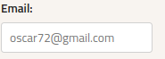
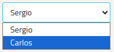

# Fantasy Formula1

**Desafío 2 de las asignaturas Desarrollo Web en Entorno Cliente y Diseño de Interfaces Web.**

En este proyecto se realizará una réplica sencilla de Fantasy Football pero con pilotos y carreras de F1.

## Desarrolladores

- [Óscar Moreno](https://github.com/oscarMoreno02)
- [Elena Rodríguez](https://github.com/ElenaRgC)

## Dependencias

- SASS
- Bundler

### Instalación de dependencias

Se encuentran instaladas localmente, es suficiente con ejecutar `npm install` en el directorio del proyecto.

## Desarrollo y compilación del proyecto

### Descargar modulos
Es imprescindible tener instalado en nuestro equipo `NodeJS` y el sistema de gestión de paquetes `npm`.

Desde la [pagina oficial](https://nodejs.org/en/download) podremos elegir la versión que desesamos instalar.

### Descargar modulos

Lanzando `npm update` podremos actualizar los modulos de nuestro proyecto a traves del instalador de paquetes y poder ejecutar el resto de comandos.

### Montar un servidor de desarrollo

Lanzando `npm run dev` podremos cambiar nuestro proyecto y ver cambios en tiempo real.

### Construir el proyecto

Para que nuestro proyecto se compile, se puede ejecutar `npm run build` y se crearán los archivos necesarios para el despliegue en el directorio `/dist`.

# Guia de estilos

## Descripción, voz y tono del sitio

Adéntrate en nuestro sitio de fantasy de Fórmula 1, donde el diseño refinado y la paleta de colores meticulosamente seleccionada te sumergirán en una experiencia visualmente elegante. Con una interfaz pulcra, la claridad y precisión son la esencia, guiándote sin esfuerzo a través de la creación y gestión de equipos.

La voz y tono del sitio reflejan un equilibrio perfecto entre entusiasmo controlado y profesionalismo, capturando la seriedad de la competición y la pasión por las carreras. Este enfoque no solo celebra la estrategia y la competencia, sino que también fomenta la empatía y la conexión en una comunidad unida.

En este rincón digital, la elegancia se fusiona con la emoción, creando un espacio donde la precisión y la pasión por la Fórmula 1 se encuentran en cada interacción. Prepárate para una experiencia única donde los estilos utilizados no solo definen la estética, sino que también guían la voz que te acompañará en tu viaje por el emocionante mundo del fantasy automovilístico

## Colores

### Paleta de colores

| F1 High-Vis White | F1 Off-White | F1 Warm Red | F1 Carbon Black |
| ----------------- | ------------ | ----------- | --------------- |
| #ffffff           | #f8f4f0      | #ff1800     | #0c0c18         |

[Paleta en coolors.co](https://coolors.co/ffffff-f8f4f0-ff1800-0c0c18)

### Usos

#### Tema claro

| F1 Warm Red   | F1 Carbon Black           | F1 Off-White        | F1 High-Vis White      |
| ------------- | ------------------------- | ------------------- | ---------------------- |
| Cabecera      | Texto del cuerpo          | Fondo de pantalla   | Texto en cabecera      |
| Pie de página | Texto botones secundarios | Botones secundarios | Texto en pie de página |
| Botones       |                           |                     | Texto de los botones   |

#### Tema oscuro

| F1 Warm Red   | F1 Carbon Black           | F1 Off-White        | F1 High-Vis White         |
| ------------- | ------------------------- | ------------------- | ------------------------- |
| Cabecera      | Fondo de pantalla         | Títulos             | Texto del cuerpo          |
| Pie de página | Texto botones secundarios | Botones secundarios | Texto botones secundarios |
| Botones       |                           |                     |                           |

## Tipografía

### Fuentes

 | F1 Torque                                                                                                                                    | F1 Regular                                                                                                                                     | Titillium Web                                            |
 | -------------------------------------------------------------------------------------------------------------------------------------------- | ---------------------------------------------------------------------------------------------------------------------------------------------- | -------------------------------------------------------- |
 |  |  |  |

### Tamaños y usos

 | F1 Torque        | F1 Regular      | Titillium Web |
 | ---------------- | --------------- | ------------- |
 | Títulos noticias | Nombres pilotos | Cuerpo web    |
 |                  | Menús           | Botones       |

## Iconografía

### Logo

Se usará en la parte superior izquierda de la cabecera. Pueden emplearse  variaciones en blanco o en negro.

### Iconos

Se usarán iconos del estilo **Material Filled** de [icons8](https://icons8.com/icons/material).

Estos iconos son de estilo sólido, por lo que contrastan bien en monocolor. Además, icons8 nos permite modificarlos desde la web y obtenerlos en formato `.png` o `.svg`.

## Imágenes

### Fotografías de los pilotos

| Tamaño orignal | Formato |
| -------------- | ------- |
| 130 x 185 px   | `.jpg`  |

Todas las imágenes tendrán el mismo tamaño original y mantendrán esta proporción según las dimensiones del navegador.

### Recorrido del circuito

| Proporción | Formato         |
| ---------- | --------------- |
| 1:1        | `.png` o `.svg` |

Las imágenes de los circuitos se mostrarán en formato cuadrado, con un tamaño relativo según las dimensiones de la pantalla.

Tendrán un formato `.png` o `.svg` para mantener un fondo transparente.

### Fondo

## Elementos interactivos

### Cajas de texto

### Selectores

### Botones

Los botones usarán la fuente `Titillium Regular` y color de fuente blanco.

Los botones principales usarán el color de fondo `F1 Warm Red` y los secundarios `F1 Carbon Black`.
## MAPA DE NAVEGACIÓN
.png>)
## Recursos

- [Fuentes](https://imjustcreative.com/download-f1-fonts-formula-1-fonts/2021/09/16)
- [Assets varios](https://www.f1assets.com/homepage)
- [Logo](https://en.m.wikipedia.org/wiki/File:F1.svg)
- [Colores de equipos](https://www.reddit.com/r/formula1/comments/11a3wnj/f1_2023_hex_codes/)
- [Guia de uso](https://www.formula1.com/en/toolbar/guidelines.html)
- [Guia de la marca](https://ajansara.com/wp-content/uploads/F1-Master-Marka-rehberi.pdf)
- [Color de la marca](https://www.schemecolor.com/formula-one-red-logo-colors.php)
- [Circuitos](https://www.pngwing.com/en/search?q=f1+race+track)
